# University Course Management System

A comprehensive full-stack application for managing university courses, students, instructors, and academic results. Built with Spring Boot backend, Next.js frontend, and MySQL database.

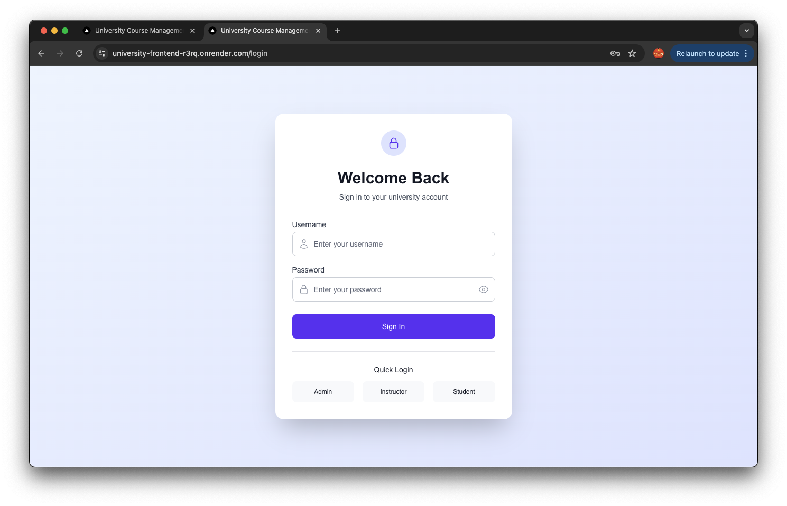

## 🚀 Features

### 👨‍💼 Administrator Dashboard
- **Statistics Overview**: Real-time metrics for courses, students, and instructors
- **Course Management**: Create, edit, and manage university courses
- **Student Management**: Comprehensive student enrollment and profile management
- **Instructor Management**: Add and manage teaching staff

<div align="center">
  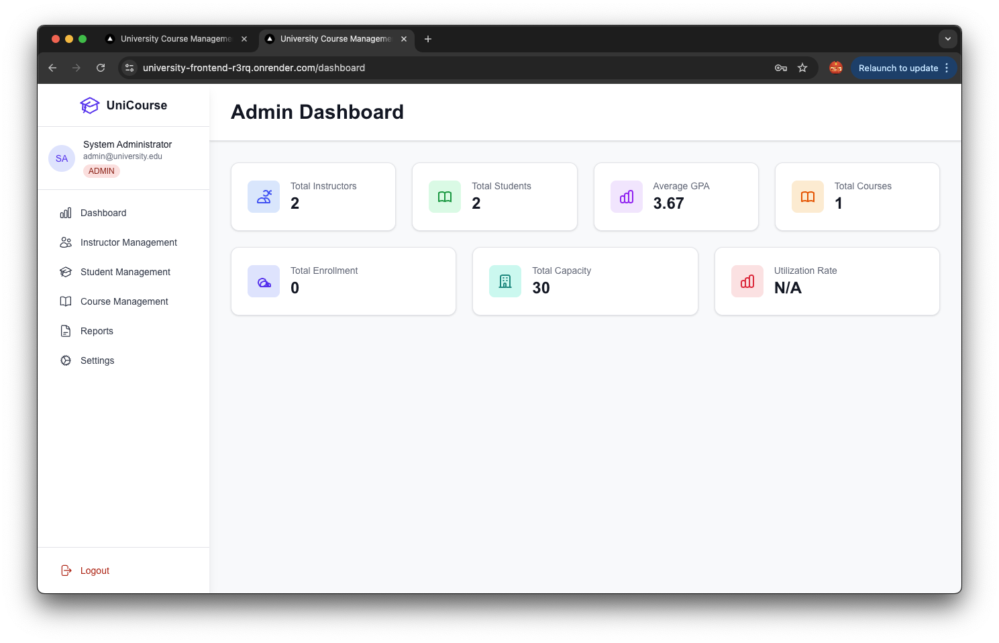
  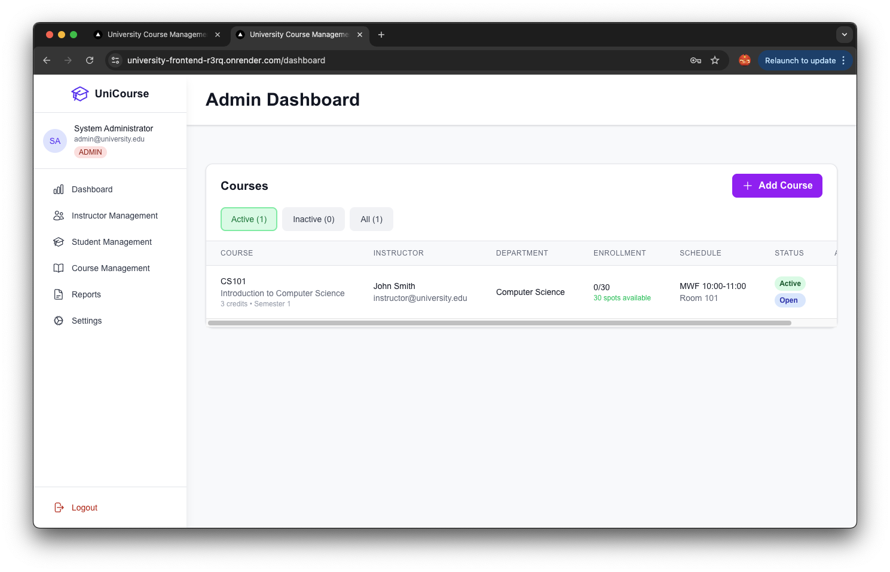
</div>

<div align="center">
  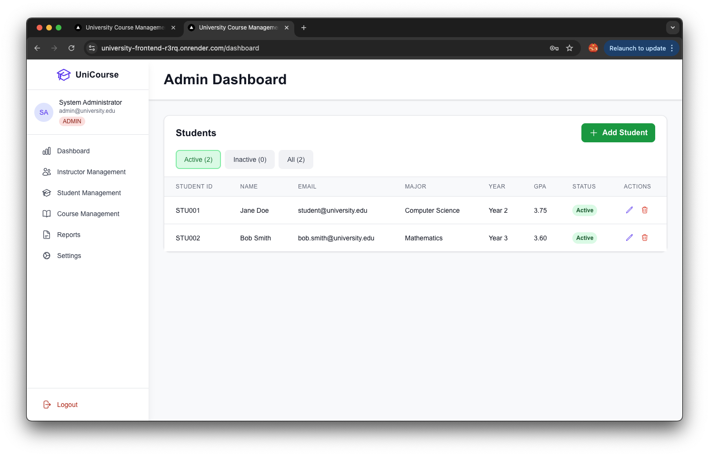
  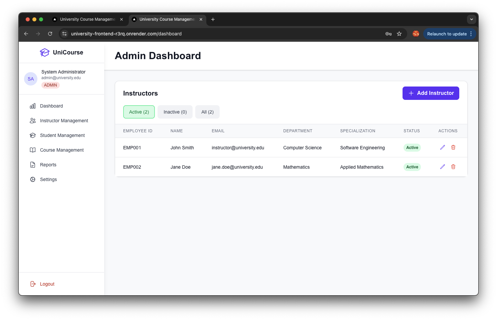
</div>

### 👨‍🏫 Instructor Portal
- **Dashboard Analytics**: Track course performance and student progress
- **Course Management**: Manage assigned courses and content
- **Result Management**: Add and manage student grades and assessments
- **Profile Management**: Update personal information and credentials

<div align="center">
  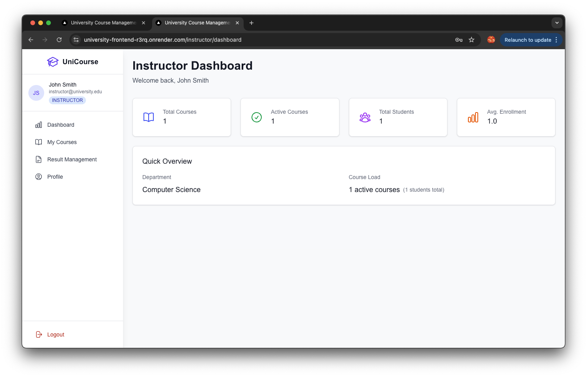
  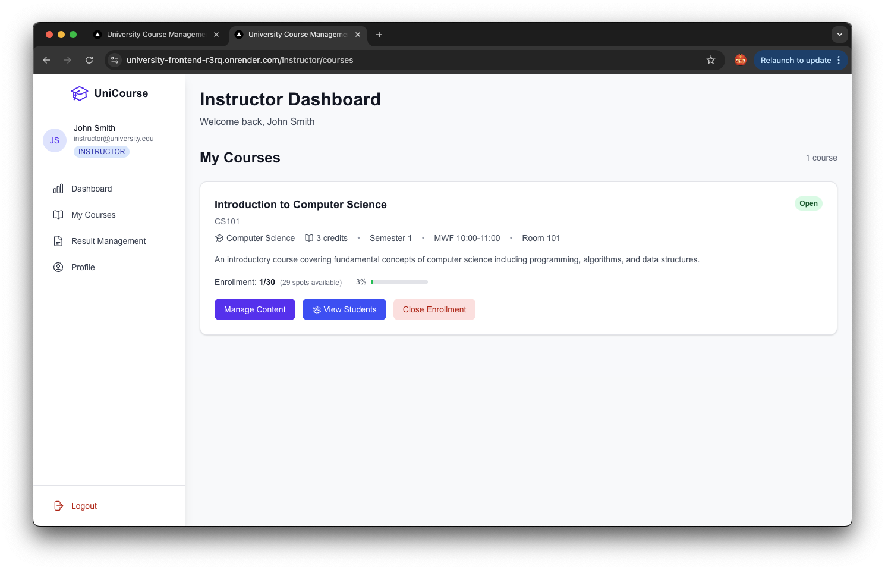
</div>

<div align="center">
  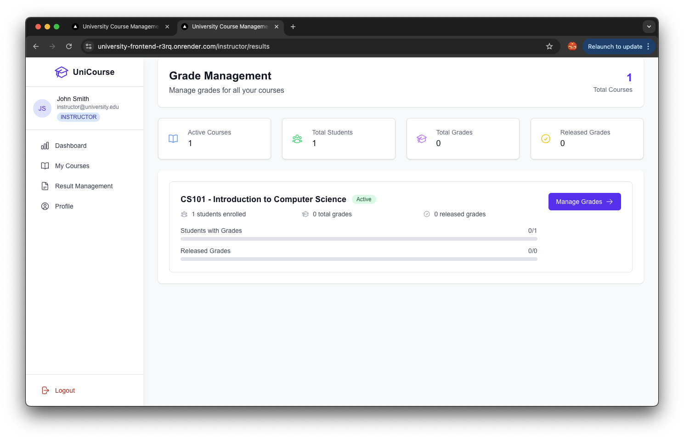
  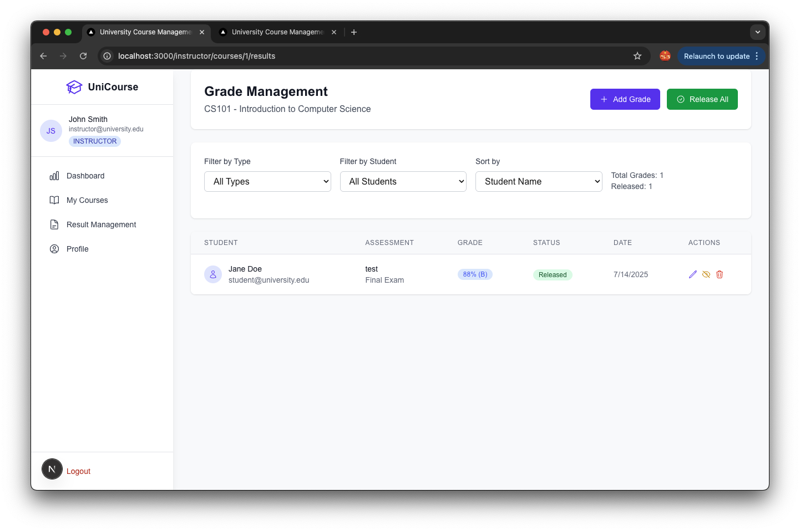
</div>

<div align="center">
  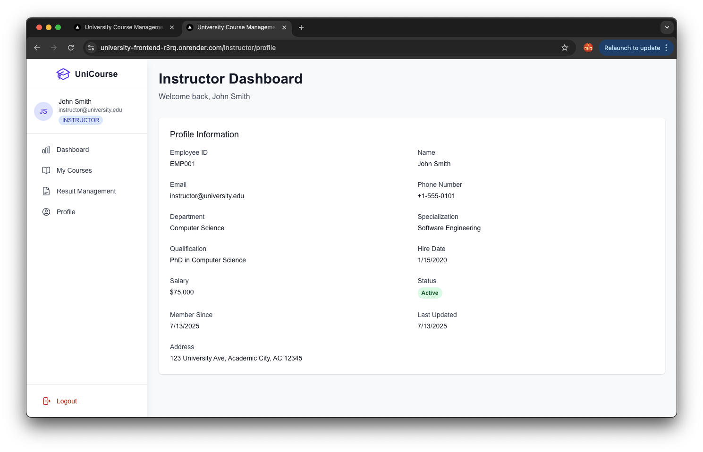
</div>

### 👨‍🎓 Student Portal
- **Personal Dashboard**: View academic progress and statistics
- **Course Catalog**: Browse and enroll in available courses
- **Enrolled Courses**: Access course materials and content
- **Results & Grades**: View academic performance and results
- **Profile Management**: Update personal information

<div align="center">
  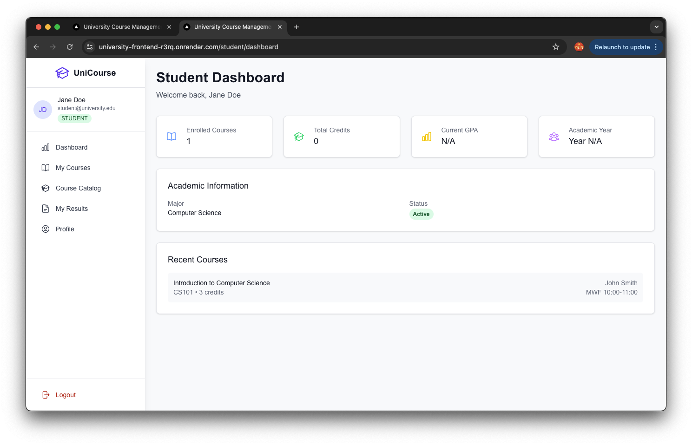
  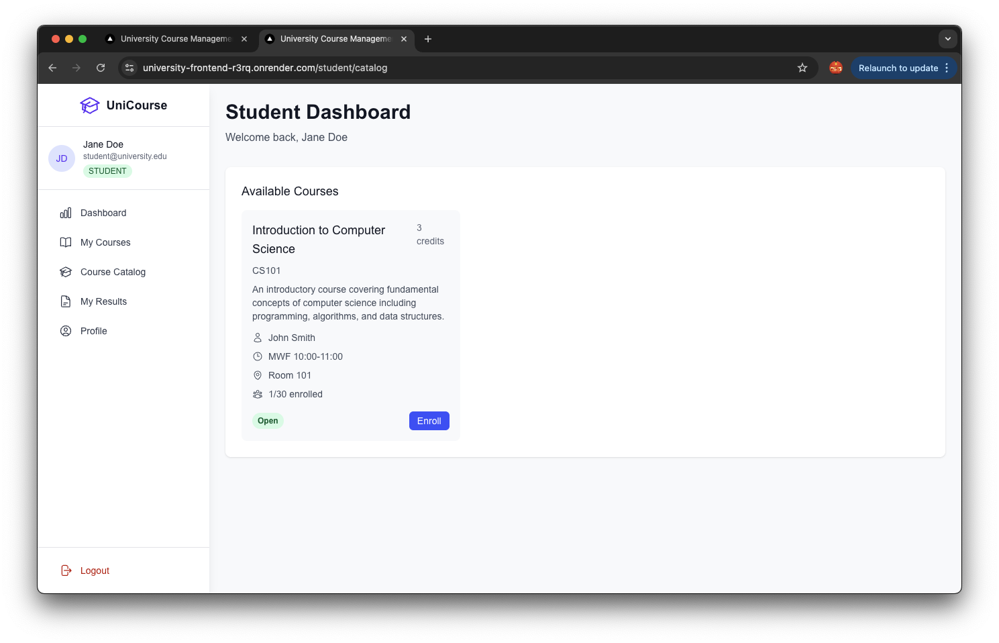
</div>

<div align="center">
  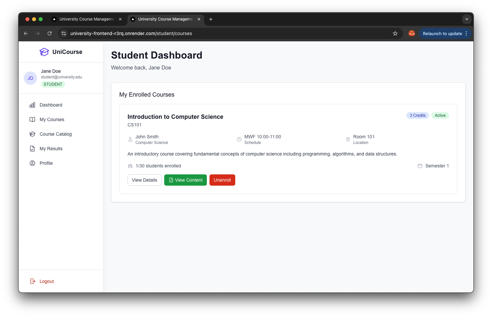
  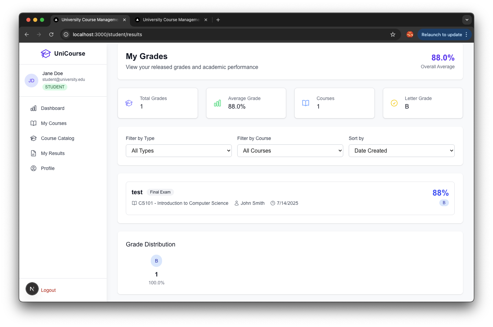
</div>

<div align="center">
  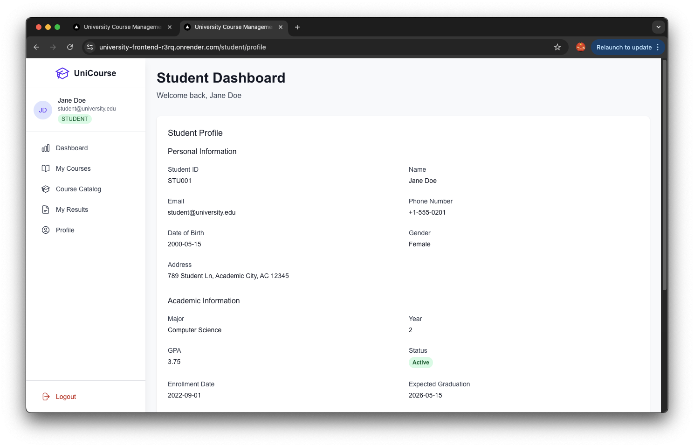
</div>

## 🛠️ Tech Stack

**Backend:**
- ☕ Spring Boot 3.x
- 🔐 Spring Security with JWT
- 🗄️ Spring Data JPA
- 🐬 MySQL Database
- 📊 RESTful APIs

**Frontend:**
- ⚛️ Next.js 14
- 🎨 Tailwind CSS
- 📱 Responsive Design
- 🔒 Protected Routes
- 🌐 Modern React Hooks

**DevOps:**
- 🐳 Docker & Docker Compose
- ☁️ Render.com Ready
- 🚀 CI/CD Pipeline

## 🚀 Quick Deploy on Render (Free)

### One-Click Deploy
1. Push your code to GitHub
2. Go to [render.com](https://render.com)
3. Click "New +" → "Blueprint"
4. Connect your GitHub repository
5. Render will automatically deploy everything!

### Manual Deploy
1. **Create MySQL Database** on Render
2. **Create Backend Service**:
   - Environment: `Java`
   - Build: `cd backend && ./gradlew build -x test`
   - Start: `cd backend && java -jar build/libs/*.jar`
   - Health Check: `/actuator/health`

3. **Create Frontend Service**:
   - Environment: `Node`
   - Build: `cd frontend && npm install && npm run build`
   - Start: `cd frontend && npm start`

## ⚙️ Local Development

### Prerequisites
- Java 17+
- Node.js 18+
- MySQL 8.0+
- Docker (optional)

### Backend Setup
```bash
cd backend
./gradlew bootRun
```
Backend will run on `http://localhost:8080`

### Frontend Setup
```bash
cd frontend
npm install
npm run dev
```
Frontend will run on `http://localhost:3000`

### Environment Variables

Create `.env.local` in frontend directory:
```env
NEXT_PUBLIC_API_URL=http://localhost:8080
```

Create `application-local.properties` in backend/src/main/resources:
```properties
spring.datasource.url=jdbc:mysql://localhost:3306/course_management
spring.datasource.username=your_username
spring.datasource.password=your_password
jwt.secret=your_jwt_secret_key
```

## 🐳 Docker Setup

```bash
# Start all services
docker-compose up --build

# Access
# Frontend: http://localhost:3000
# Backend: http://localhost:8080
# Database: localhost:3306
```

## 📡 API Endpoints

### Authentication
- `POST /api/auth/login` - User login
- `POST /api/auth/register` - User registration

### Courses
- `GET /api/courses` - Get all courses
- `POST /api/courses` - Create course (Admin)
- `PUT /api/courses/{id}` - Update course (Admin)
- `DELETE /api/courses/{id}` - Delete course (Admin)

### Students
- `GET /api/students` - Get all students (Admin)
- `POST /api/students` - Create student (Admin)
- `PUT /api/students/{id}` - Update student
- `GET /api/students/{id}/courses` - Get student courses

### Instructors
- `GET /api/instructors` - Get all instructors (Admin)
- `POST /api/instructors` - Create instructor (Admin)
- `PUT /api/instructors/{id}` - Update instructor
- `GET /api/instructors/{id}/courses` - Get instructor courses

### Results
- `GET /api/results` - Get results
- `POST /api/results` - Add result (Instructor)
- `PUT /api/results/{id}` - Update result (Instructor)

## 🔐 Default Users

| Role | Email | Password |
|------|-------|----------|
| Admin | admin@university.edu | admin123 |
| Instructor | instructor@university.edu | instructor123 |
| Student | student@university.edu | student123 |

## 📦 Project Structure

```
university-course-management/
├── backend/                 # Spring Boot API
│   ├── src/main/java/      # Java source code
│   ├── src/main/resources/ # Configuration files
│   └── build.gradle        # Dependencies
├── frontend/               # Next.js application
│   ├── src/app/           # Pages and routing
│   ├── src/components/    # React components
│   ├── src/contexts/      # Context providers
│   └── package.json       # Dependencies
├── docker-compose.yml     # Local development
├── docker-compose.prod.yml # Production setup
└── render.yaml            # Render deployment config
```

## 🚀 Free Tier Deployment Limits

- **Web Services**: 750 hours/month
- **Databases**: 90 days free trial
- **Bandwidth**: 100GB/month
- **Auto HTTPS**: Included
- **Global CDN**: Included

## 🤝 Contributing

1. Fork the repository
2. Create your feature branch (`git checkout -b feature/AmazingFeature`)
3. Commit your changes (`git commit -m 'Add some AmazingFeature'`)
4. Push to the branch (`git push origin feature/AmazingFeature`)
5. Open a Pull Request
